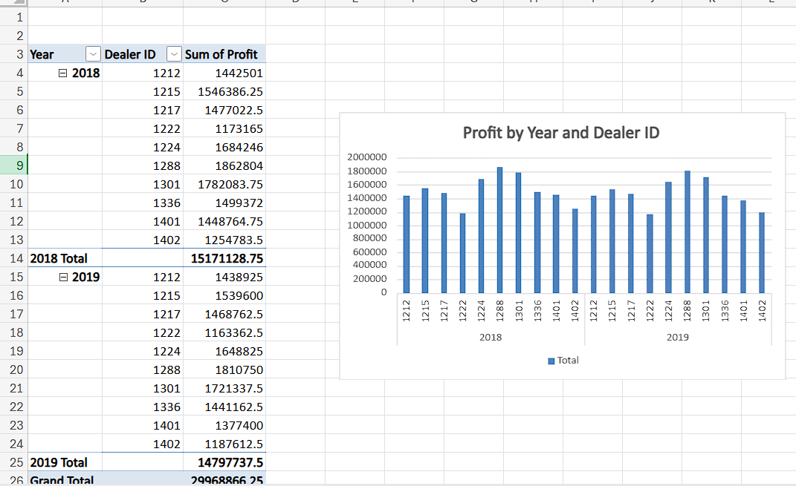
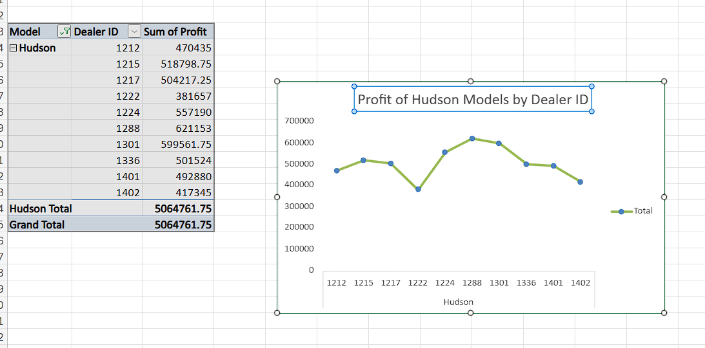
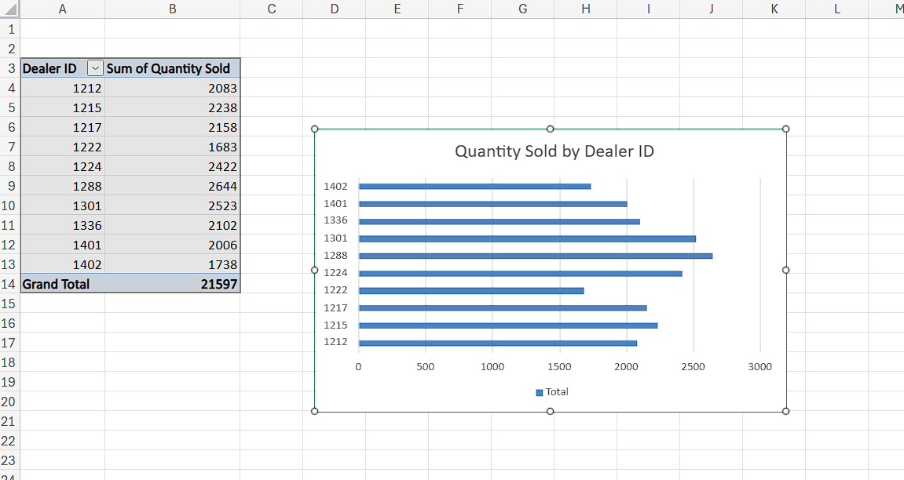

# 🚗 Automotive Sales & Service Analytics Dashboard

## 📊 Project Overview

This project analyzes automotive dealership performance across sales and service operations using Excel, IBM Cognos Analytics, and Google Looker Studio.

The objective is to transform raw dealership data into meaningful insights that support business decision-making.

---

## 🧩 Business Problem

As a regional manager, it is important to understand:

* Which dealers generate the most profit
* Which car models drive sales performance
* Where operational inefficiencies exist
* How service issues impact customer satisfaction

---

## ⚙️ Tools Used

* Microsoft Excel
* IBM Cognos Analytics
* Google Looker Studio

---

## 📊 Dashboard Preview

### 🔹 Excel Analysis





**Image Code:**

```markdown


```

---

### 🔹 Cognos Dashboard


**Image Code:**

```markdown


```

📄 Full Dashboard (PDF):
dashboards/cognos_dashboard.pdf

---

### 🔹 Looker Studio Dashboard


**Image Code:**

```markdown


```

📄 Full Dashboard (PDF):
dashboards/looker_dashboard.pdf

---

## 🔗 Dashboard Access

👉 https://lookerstudio.google.com/reporting/YOUR-DASHBOARD-LINK-HERE

---

## 📁 Data Sources

* Automotive sales dataset (Excel format)
* Includes dealer performance, product sales, profit, and service metrics

---

## 📈 Key Insights

* Dealer performance varies significantly across regions
* High sales volume does not always translate into high profit
* Certain models dominate sales but generate lower margins
* Some models show higher recall frequency, indicating quality issues
* Customer sentiment highlights areas needing service improvement

---

## 🎯 Business Recommendations

* Focus on strategies used by top-performing dealers
* Optimize pricing for low-margin, high-volume models
* Address recurring technical issues in affected systems
* Improve customer experience to reduce negative sentiment
